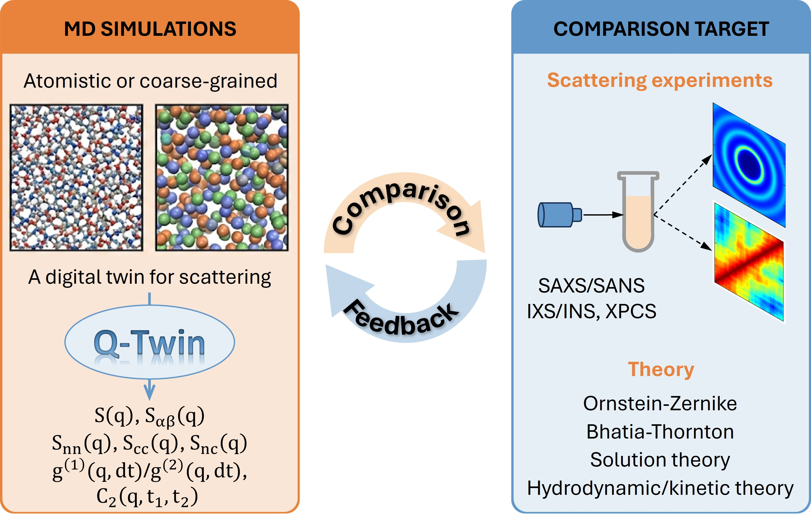

# Welcome to Q-Twin Documentation

`Q-Twin`: A Digital-Twin Beamline for Molecular Scattering and Coherent Dynamics, with a graphical user interface that can be used locally or in the cloud.

    

