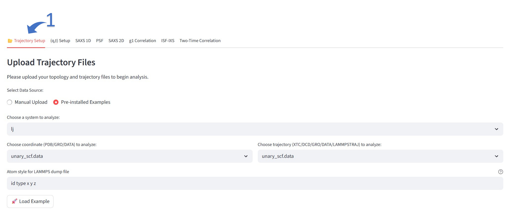
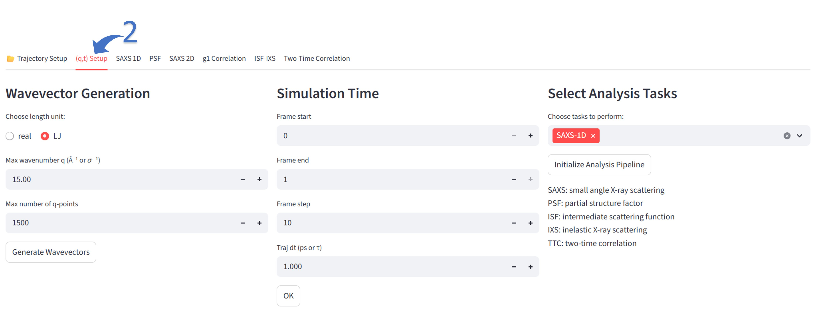
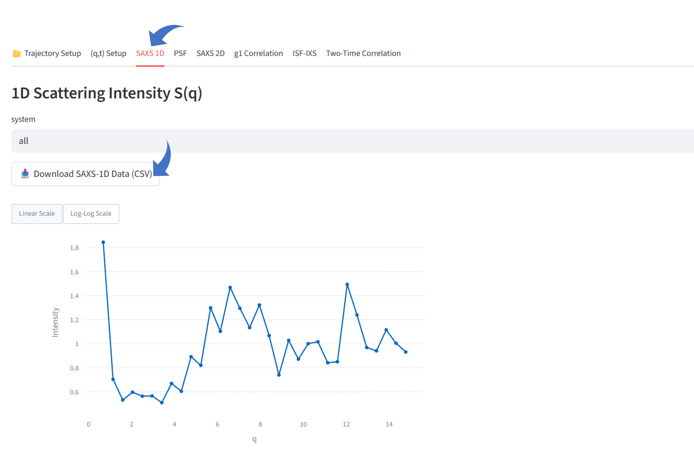

## Workflow

The software workflow consists of the following steps:

1. Trajectory Setup: Upload a simulation trajectory or load one of the preinstalled trajectories.
2. System Summary: Review the automatically generated summary of the simulation system.
3. (q,t) Setup: Specify the parameters of interest for q and time, and select the desired analysis tasks.
4. Review Outputs: Navigate to the corresponding tabs to review the analysis results. Note that only the selected tasks will be activated and displayed.

### Example
Here the supercritical Lennard-Jones liquid is used as an example.

Load the trajectory

    

Set the (q,t) and tasks

    

Results review and data download

    

### Command line usage

